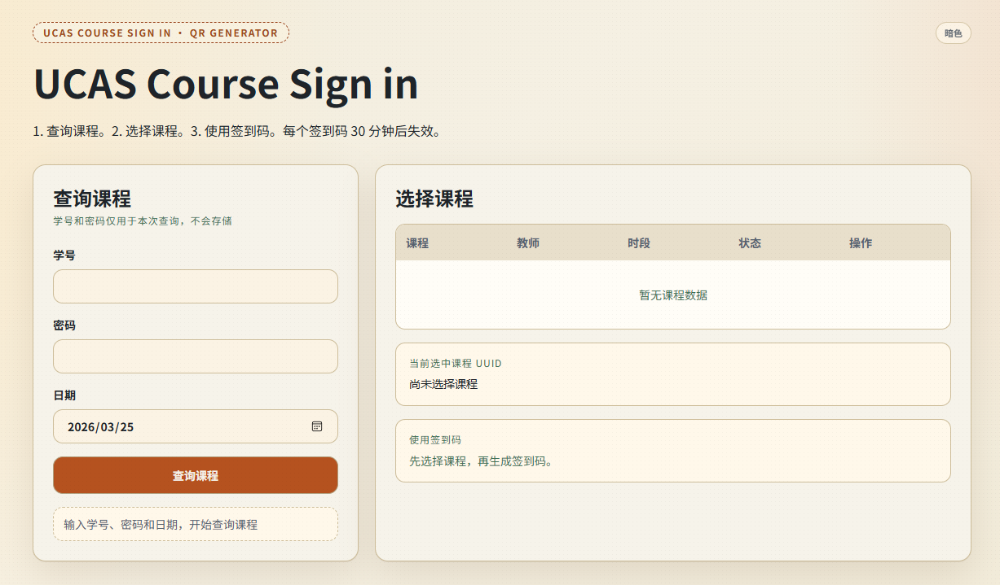
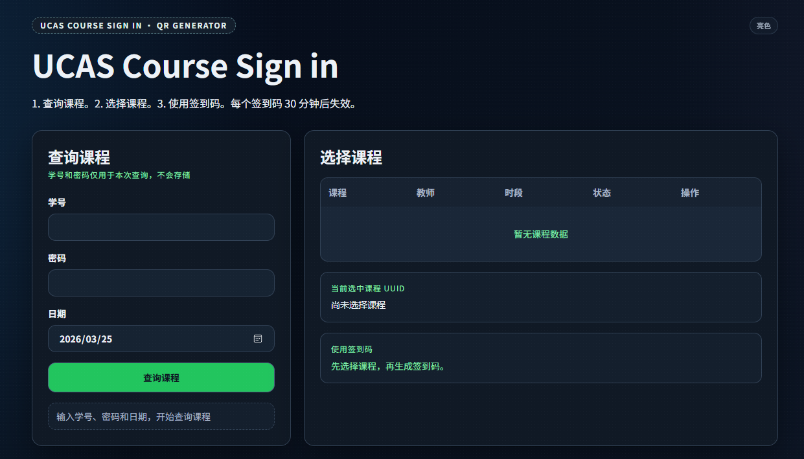
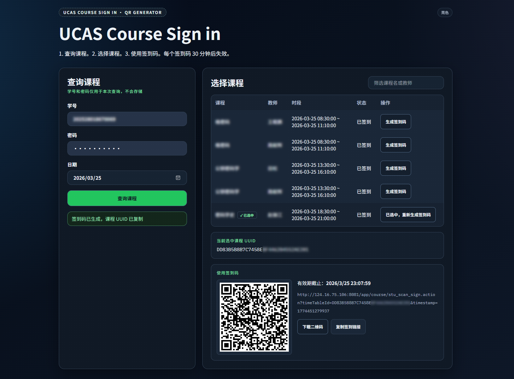

# UCAS Course Sign in

基于 Next.js 16 的课程查询与签到二维码生成工具。

>[!CAUTION]
> **本项目仅供学习交流使用，请勿用于任何商业与非法用途。**

项目仅出于**学习目的**，复现 XXXAPP 课表查询链路，在网页端完成以下流程：

1. 登录上游接口 `login.action`
2. 使用返回的 `sessionId` + `id` 查询 `get_stu_course_sched.action`
3. 返回当日课程列表并展示课程 `uuid`
4. 选择课程后生成 30 分钟有效的签到二维码

## 项目特点

- 账号密码 + 日期一键查询当天课程
- 服务端代理上游请求，规避浏览器跨域限制
- 支持课程关键词筛选
- 一键复制课程 UUID
- 自动生成签到二维码（可下载 PNG）
- 亮色/暗色主题切换
- 输入信息不存储，不向前端返回 `sessionId`

## 页面功能

- 查询面板：输入学号、密码、日期并发起查询
- 课程列表：按课程名/教师名筛选，点击课程生成签到码
- 二维码面板：显示有效期、原始链接、下载二维码
- 状态提示：按请求状态展示成功/失败/加载信息

运行截图：







## 快速开始

### 访问在线网站（推荐）

访问部署在 Vercel 的在线版本：[UCAS Course Sign in](https://ucas-sign-in.vercel.app/)

### 从源码运行

1. 克隆并安装依赖

```bash
git clone https://github.com/lccipher/UCAS-Course-Sign-in
cd UCAS-Course-Sign-in
npm install
```

2. 启动开发环境

```bash
npm run dev
```

默认访问：`http://localhost:3000`

3. 生产构建与启动

```bash
npm run build
npm run start
```

4. 代码检查

```bash
npm run lint
```

## 技术栈

### 前端

- Next.js 16.2.1（App Router）
- React 19.2.4
- TypeScript 5
- Tailwind CSS 4
- next/font（Noto Sans SC / Noto Serif SC / IBM Plex Mono）

### 服务端

- Next.js Route Handler（Node.js runtime）
- 原生 Fetch + AbortController 超时控制
- 内存级限流（5 分钟窗口 + 每日上限）

### 工具链

- ESLint 9 + eslint-config-next
- qrcode 1.5.4（前端二维码生成）

## 项目结构

```text
.
├─ src/
│  └─ app/
│     ├─ api/
│     │  └─ course-uuid/
│     │     └─ query/
│     │        └─ route.ts      # 登录+课表查询服务端接口
│     ├─ globals.css            # 全局样式与主题变量
│     ├─ layout.tsx             # 字体、元信息、主题初始化
│     └─ page.tsx               # 主页面（查询、列表、二维码）
├─ public/
├─ package.json
└─ README.md
```

## 工作流程与架构

```text
Browser
	-> POST /api/course-uuid/query
		-> login.action (上游登录)
		-> get_stu_course_sched.action (上游课表)
	<- 返回课程列表（已脱敏整理）
Browser
	-> 本地生成签到 URL + QR Code
```

说明：

- 上游 `sessionId` 仅在服务端请求链路内短暂使用，不回传前端。
- 前端二维码是根据所选课程 UUID 和过期时间戳本地生成。

## API

### POST /api/course-uuid/query

请求头：

- `Content-Type: application/json`

请求体：

```json
{
	"username": "2025xxxxxxxxxx",
	"password": "your-password",
	"date": "20260325"
}
```

参数说明：

- `username`: 学号（必填）
- `password`: 密码（必填）
- `date`: 查询课程日期（必填）

成功响应示例：

```json
{
	"date": "20260325",
	"total": 2,
	"courses": [
		{
			"id": "1144894",
			"uuid": "CADD27F17ACC44EDAFxxxxxxxxxxxxxx",
			"courseName": "xxxxxxx",
			"teacherName": "xxx",
			"weekDay": "周三",
			"classBeginTime": "2026-03-25 10:25:00",
			"classEndTime": "2026-03-25 12:00:00",
			"signStatus": "1"
		}
	]
}
```

错误响应示例：

```json
{
	"message": "登录接口请求超时",
	"code": "UPSTREAM_LOGIN_TIMEOUT"
}
```

## 错误码与排查

HTTP 状态码：

- `400`: 请求体或参数格式错误
- `401`: 登录失败（账号密码错误或上游鉴权失败）
- `403`: 非同源请求
- `415`: Content-Type 非 JSON
- `429`: 触发限流
- `502`: 上游接口异常/返回异常
- `504`: 上游接口超时
- `500`: 服务内部异常

常见 `code`：

- `RATE_LIMITED`
- `UPSTREAM_LOGIN_HTTP`
- `UPSTREAM_LOGIN_BAD_JSON`
- `UPSTREAM_LOGIN_TIMEOUT`
- `UPSTREAM_LOGIN_NETWORK`
- `UPSTREAM_SCHEDULE_HTTP`
- `UPSTREAM_SCHEDULE_BAD_JSON`
- `UPSTREAM_SCHEDULE_TIMEOUT`
- `UPSTREAM_SCHEDULE_NETWORK`
- `UNEXPECTED_ERROR`

注意事项：

- 上游接口使用 `https://xxxxxx.ucas.edu.cn:8181`，端口 `8181` 不能省略。

## 安全与隐私

- 不在服务端持久化账号密码
- 不向前端返回 `sessionId`
- 接口默认 `Cache-Control: no-store`
- 启用基础安全响应头（如 `X-Content-Type-Options`、`X-Frame-Options`）
- 启用基础限流（5 分钟窗口 + 日请求上限）

## 可选环境变量

项目可在不配置环境变量的情况下运行；如需调整限流策略，可选：

- `RATE_LIMIT_5M_MAX`：5 分钟窗口最大请求数，默认 `5`
- `RATE_LIMIT_DAILY_MAX`：单 IP 每日最大请求数，默认 `20`

## 部署

### Vercel（推荐）

1. 推送仓库到 GitHub
2. 在 Vercel 导入项目
3. Framework 使用 Next.js（自动识别）
4. Build Command 使用默认 `npm run build`
5. 完成部署后访问生成域名

### Cloudflare 说明

Cloudflare Workers/Pages 可能受非标准端口访问限制，不作为首选。若必须使用，建议增加可访问 `8181` 的中转代理层。

## 合规与使用声明

- 该工具仅供学习交流使用，请勿用于任何商业与非法用途
- 该工具仅用于使用者本人合法授权账号
- 请勿用于绕过平台风控、自动签到或任何违规用途
- 若上游引入验证码/二次验证/风控策略，需要按平台规则补充人工验证流程

## License

[AGPL-3.0 License](./LICENSE)
